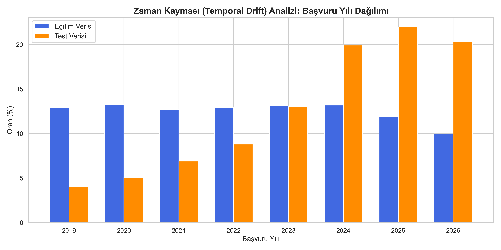
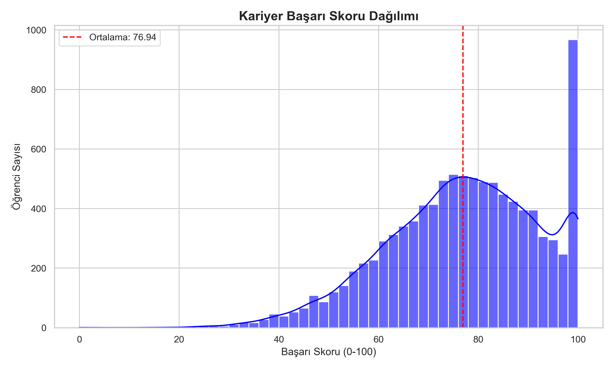
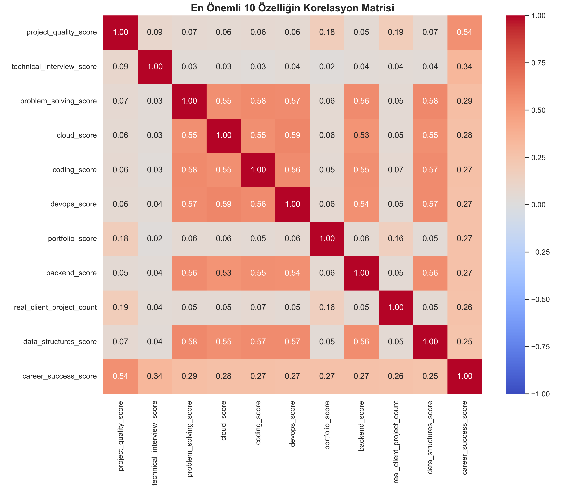
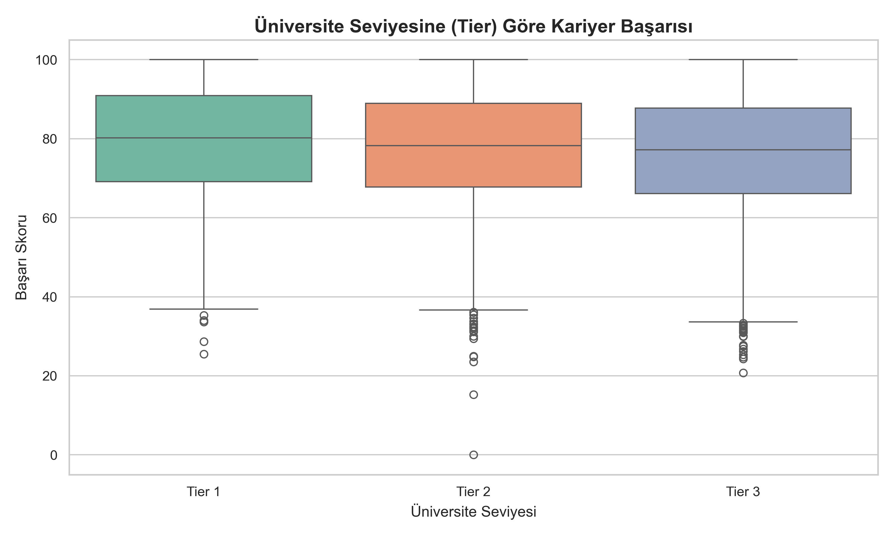

# BTK Datathon: Kariyer Başarı Skoru Tahmini 

Bu projede öğrencilerin kariyer başarı skorlarını tahmin etmeye yönelik kapsamlı bir makine öğrenmesi modeli geliştirdim. Public Leaderboard'da **82.656**, Private Leaderboard'da ise **83.905** skorlarına ulaşarak modelin başarısını kanıtladım. Bu repository, modelleme sürecini, özellik mühendisliğini (feature engineering) ve denenen çeşitli makine öğrenmesi stratejilerini içermektedir.

---

## Projenin Amacı ve Karşılaşılan Temel Sorun
Veri setinde öğrencilere ait üniversite notları, katıldıkları mülakatlar, teknik yetenekleri ve mentörlerin onlar hakkındaki geri bildirim metinleri (`mentor_feedback_text`) yer almaktaydı. Amaç, 0 ile 100 arasında sürekli bir değişken olan **Kariyer Başarı Skoru (career_success_score)** tahminini yapabilmekti.

### Temel Sorun: Zaman Kayması (Covariate Shift / Temporal Drift)
Geliştirme sürecinde karşılaşılan en büyük sorun, eğitim ve test verileri arasındaki zaman uyuşmazlığıydı. Eğitim verisi 2020-2022 yıllarındaki profillere ağırlık verirken, tahmin edilmesi beklenen test verisi ağırlıklı olarak 2024-2026 yıllarındaki öğrencilerden oluşuyordu.

**Çözüm Yöntemi:**
Bu zaman kayması problemini çözmek için eğitim verisindeki örneklemlere `application_year` (başvuru yılı) bazında test dağılımını yansıtacak şekilde `sample_weight` (örneklem ağırlığı) ataması yaptım. Bu optimizasyon, modelin eski örüntülere aşırı uyum sağlamasını engelleyerek genel tahmin başarısını önemli ölçüde artırdı.

---

## Keşifçi Veri Analizi (EDA) ve Görselleştirme
Modelleme sürecine geçmeden önce verinin doğasını, dağılımını ve özellikler arası ilişkileri anlamak amacıyla detaylı bir EDA gerçekleştirdim. Görselleştirme kodlarına `src/00_eda/` dizininden ulaşılabilir.

### 1. Zaman Kayması (Temporal Drift) Etkisi
Eğitim seti ile test seti arasındaki başvuru yılı (`application_year`) uyumsuzluğu modelin genelleme yeteneğini düşüren en büyük faktördü. Dağılımların nasıl ayrıştığı aşağıdaki grafikte net bir şekilde görülebilir:

### 2. Hedef Değişken (Kariyer Başarı Skoru) Dağılımı
`career_success_score` değişkeninin 0-100 arasında nasıl dağıldığını inceledim. Modelin asimetrik (çarpık) tahminler üretmemesi için hedefin ortalama etrafındaki yığılmasını hesaba kattım:

### 3. Değişkenler Arası Korelasyon
Hedef değişkenle doğrusal ilişkisi en yüksek olan sayısal özellikleri analiz ettim. Bu durum özellik mühendisliği (feature engineering) aşamasına doğrudan rehberlik etti:

### 4. Kategorik Değişken Etkisi (Örnek: Üniversite Seviyesi)
Ağaç tabanlı algoritmaların iyi kavrayabilmesi için kategorik değişkenlerin (örneğin üniversitenin kademesinin) hedef üzerindeki etkisini inceledim:

---

## Veri Mühendisliği (Feature Engineering)
Mevcut özellikleri kullanarak yeni ve daha açıklayıcı değişkenler ürettim:
- **Matematiksel Gruplamalar:** Teknik yeteneklerin (SQL, Java vb.) ortalamasını (`tech_mean`) ve sosyal yeteneklerin ortalamasını (`soft_mean`) hesapladım.
- **Oran Analizleri:** `Mülakat Başarı Oranı = Katılınan Mülakat / Gönderilen Başvuru` gibi modele doğrudan yön gösterecek mantıksal oranlar oluşturdum.
- **Target Encoding:** Üniversite, Bölüm gibi kategorik değişkenleri One-Hot Encoding ile dönüştürmek yerine, 5-Fold Cross Validation eşliğinde hedef değişkenin ortalamasına göre sayısallaştırdım (Target Encoding). Bu yöntem aşırı öğrenmeyi (Overfitting) engelledi.

---

## Doğal Dil İşleme: Mentör Notlarının Vektörel Analizi
Modelin en kritik bileşenlerinden biri `mentor_feedback_text` sütununun işlenmesiydi. 
- **TF-IDF Yaklaşımı:** İlk aşamada uyguladığım temel kelime sayım yöntemleri, bağlamsal anlamı yakalamada yetersiz kaldı.
- **BGE-M3 (LLM) Kullanımı:** Çok dilli metin anlama kapasitesi yüksek olan `BAAI/bge-m3` modelini kullanarak mentör notlarını 1024 boyutlu vektörlere dönüştürdüm. Boyutluluğun Laneti (Curse of Dimensionality) problemini aşmak için, bu vektörleri ayrı bir Ridge Regression modeli ile 1 boyutlu bir tahmin skoruna (`ft_bgem3`) indirgedim. Ana modellere doğrudan vektörleri değil, sadece bu tek boyutlu sinyali besledim.

---

## Model Mimarisi: Level-2 Stacking
Modelleme sürecinde tek bir algoritma yerine dört farklı mimarinin gücünü birleştiren bir Level-2 Stacking (Yığınlama) yapısı kurdum:
1. **LightGBM:** Hızlı ve tablo verisinde etkili.
2. **CatBoost:** Kategorik özelliklerde güçlü.
3. **XGBoost:** Geleneksel ve sağlam tahminleme yeteneği.
4. **PyTorch MLP (Yapay Sinir Ağı):** Ağaç tabanlı modellerin (Tree-based) tespit edemediği doğrusal olmayan (non-linear) karmaşık ilişkileri yakalaması için geliştirilen 2 gizli katmanlı mimari.

Bu dört modelden elde edilen tahminler, `Scipy Optimize` kullanılarak optimize edildi ve en uygun ağırlıklarla birleştirilip nihai tahmin oluşturuldu.

---

## Final Gönderimleri (Submission Analizi)
Süreç boyunca denenmiş en başarılı yaklaşımlar:

1. **`submission_mega_upgrade.csv` (Public: 82.656 | Private: 83.913)**
   - Public Leaderboard'daki en başarılı modelim. LGB, CAT, XGB ve MLP konseyinden oluşan, Temporal Drift çözümü ve BGE-M3 sinyali entegre edilmiş ana mimaridir.

2. **`submission_iterative_pl_raw.csv` (Public: 82.699 | Private: 83.905)**
   - Private Leaderboard'daki en iyi sonucu veren çalışmam. "Iterative Pseudo Labeling" yöntemi uygulandı: Mega Upgrade modelinin ürettiği en güvenilir tahminler (%90 güven aralığı), eğitim setine dahil edilerek modeller yeniden eğitildi. Bu yöntem OOF (Out-of-Fold) hatasını önemli ölçüde düşürdü.

3. **`submission_grandmaster.csv` (Public: 83.988 | Private: 84.278)**
   - Metin özelliklerinin direkt olarak CatBoost Native Text parametresiyle işlenmesi ve aykırı değerleri izole etmek amacıyla Huber Loss kullanılarak oluşturulmuş alternatif bir deney modelidir.

---

## Kod Dizini (src/)
Çalışma dizinimde projenin temel aşamalarını içeren başarılı kodlar bulunmaktadır:
- `01_bge_m3_finetune/`: Mentör metinlerinden BGE-M3 modeli ile anlam çıkarımı.
- `02_mega_upgrade_ensemble/`: Stacking ana mimarisi.
- `03_iterative_pseudo_labeling/`: Pseudo Labeling uygulanan yenilenmiş model yapısı.
- `04_grandmaster_native_text/`: Native Text ve Huber Loss kullanılan model.
